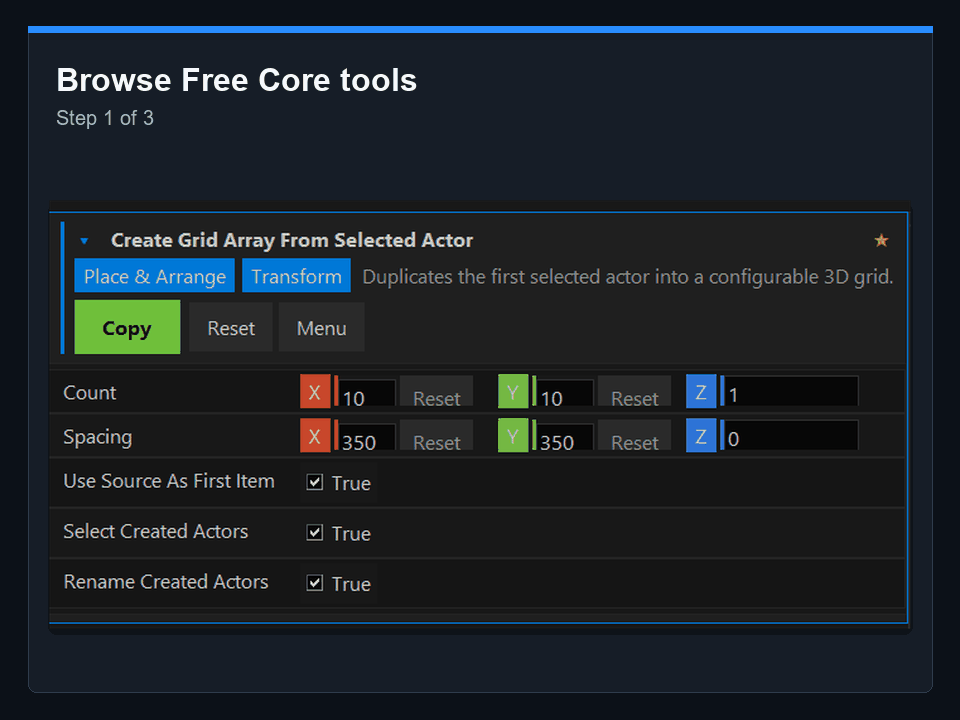
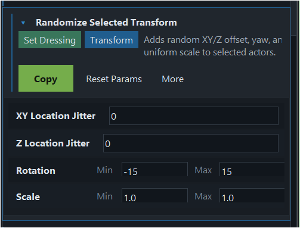
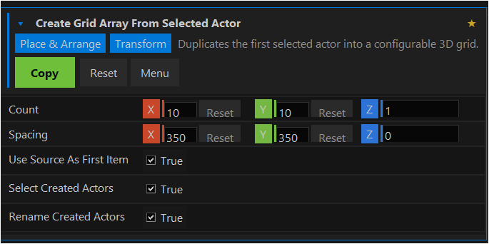
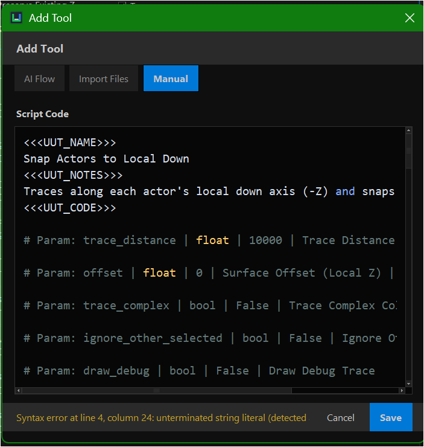

# EditorBinder

[](https://github.com/bartuom/editorbinder/actions/workflows/ci.yml)
[](https://github.com/bartuom/editorbinder/releases/latest)
[](LICENSE.txt)

Lightweight desktop utility for storing paste-ready Unreal Engine Python
Console scripts.

EditorBinder is local-first, offline by default, and built on `tkinter` from the
Python standard library. It does not connect to Unreal Engine directly. It lets
you save Python snippets, copy them to the clipboard, switch to Unreal, paste
into the Python Console, and execute.

EditorBinder is released under the MIT License. See `LICENSE.txt` and
`NOTICE.txt`.

## Screenshots









## Run From Source

Double-click:

```text
run_app.bat
```

The BAT file starts the app without creating a virtual environment or installing
third-party packages.

To add shortcuts to Desktop and Start Menu, double-click:

```text
install_shortcuts.bat
```

If the window opens off-screen or in a bad position, close the app and run:

```text
reset_window.bat
```

To force portable mode for a packaged build, run:

```text
enable_portable_mode.bat
```

This creates `portable.flag`, which tells the app to keep `user_tools.json` and
`settings.json` in the local `data` folder instead of `%APPDATA%`. Delete
`portable.flag` to return a packaged build to `%APPDATA%` storage. Source runs
already use the local `data` folder.

Manual run:

```powershell
$env:PYTHONPATH = "src"
python -m editorbinder
```

## Workflow

Open `Add Tool`, describe what the tool should do, then use
`Copy Prompt For AI`. Paste that prompt into ChatGPT, Gemini, or another AI
chat app, then paste the AI answer back into the same dialog. The app extracts
the tool name, parameters/notes, and Python code.

If the AI answer is already in the clipboard, use `Paste And Save` in
`Add Tool`. The button stays disabled while the clipboard contains a prompt
instead of a ready AI answer.

Tool parameters can include optional UI metadata:

```python
# Param: scale | float | 1.0 | Scale | min=0.1 | max=10 | step=0.1
# Param: mode | enum | selected | Mode | options=selected,all
```

Supported parameter types are `str`, `text`, `path`, `int`, `float`, `bool`,
and `enum`.

The tool menu also supports favorites, recently copied tools, parameter reset,
single-tool export, `Copy Fix Prompt`, and library backup/restore.

See `docs\ai_workflow.md` for marker-format examples, parameter metadata, and
the fix-prompt workflow.

## Bundled Tools

The default library starts with a 15-tool Free Core focused on everyday Unreal
scene cleanup, placement, audit, and batch editing:

- scene cleanup audit report,
- distribute selected actors in a grid,
- organize selected actors by Static Mesh,
- find broken or suspicious actors,
- transform selected actors,
- randomize selected transform,
- snap selected actors to ground,
- move selected actors to an Outliner folder,
- rename selected actors by pattern,
- replace text in selected actor labels,
- set collision profile on selected actor components,
- select actors using the same Static Mesh asset,
- set selected actor mobility,
- flatten selected actors to the same Z height,
- reset bad selected actor scale.

The tracked bundled seed is:

```text
data\tools.json
```

It should stay clean and contain only the default Free Core tools.

## Importing Tools

`Add Tool` includes an `Import Files` mode. It can import:

- `.zip` files containing an EditorBinder tool pack,
- `.json` files containing one tool, an array of tools, or `{ "tools": [...] }`,
- `.txt` files or clipboard text with one or more AI marker-format tools,
- `.py` files as paste-ready scripts, using `# Tool: Name` or the filename as
  the tool name,
- folders containing any of the above.

When imported tool IDs or names already exist, choose `Skip duplicates`,
`Import as copies`, or `Replace existing` before saving the import. Extracted
bundle folders are treated as one root pack when they contain
`editorbinder-pack.json`.

Import examples are available in:

```text
docs\examples\
```

See `docs\tool_packs.md` for pack JSON and folder bundle details.

## Data Locations

For source and portable runs, the editable working library file is:

```text
data\user_tools.json
```

If `data\user_tools.json` does not exist, the app seeds it from:

```text
data\tools.json
```

For packaged/frozen runs, the app stores the library in:

```text
%APPDATA%\EditorBinder\tools.json
```

Window size, position, `Always top`, and AI provider settings are saved in:

```text
data\settings.json
```

Local Unreal Python API notes and known pitfalls are kept in:

```text
docs\unreal_api_notes.md
```

## Documentation

- `QUICKSTART.md` covers the shortest first-run path.
- `docs\walkthrough.md` shows the visual first-run flow.
- `docs\ai_workflow.md` explains AI-assisted tool creation.
- `docs\tool_packs.md` documents importable pack formats.
- `docs\deployment.md` covers release packaging and verification.
- `docs\examples\` contains small import fixtures users can try directly.

## Development

Run the test suite from the repository root:

```powershell
$env:PYTHONPATH = "src"
python -m unittest discover
```

Build the source/BAT package:

```powershell
python tools\package_source_release.py
```

Build the Windows package:

```powershell
python tools\package_windows_release.py
```

## Source/BAT Package Contents

The lightweight source/BAT release is an end-user package. It includes the app,
Free Core seed, docs, icon, license files, and the BAT files needed to run or
reset the app:

```text
run_app.bat
install_shortcuts.bat
reset_window.bat
enable_portable_mode.bat
run_app.pyw
assets\editorbinder.ico
src\
data\tools.json
docs\
README.md
QUICKSTART.md
CHANGELOG.md
LICENSE.txt
NOTICE.txt
SUPPORT_POLICY.md
CONTRIBUTING.md
SECURITY.md
CODE_OF_CONDUCT.md
requirements.txt
pyproject.toml
```

The release package intentionally does not include the test suite, release build
helpers, optional pack source files, or local runtime files such as
`data\user_tools.json` and `data\settings.json`.
