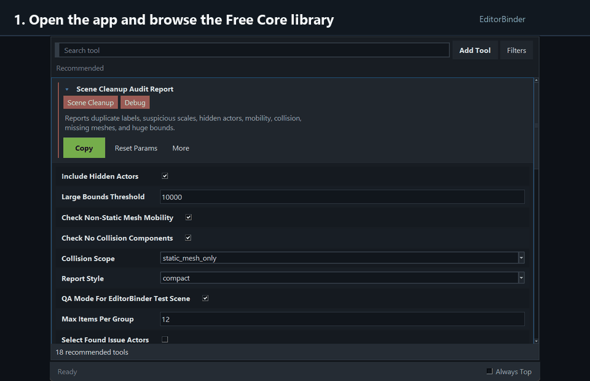
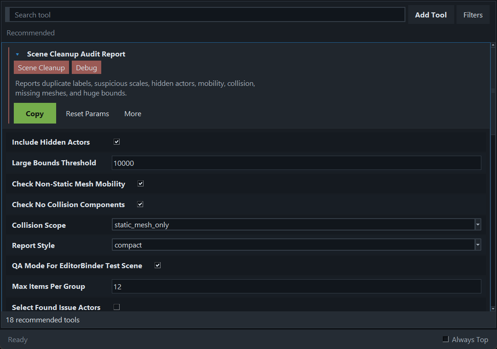
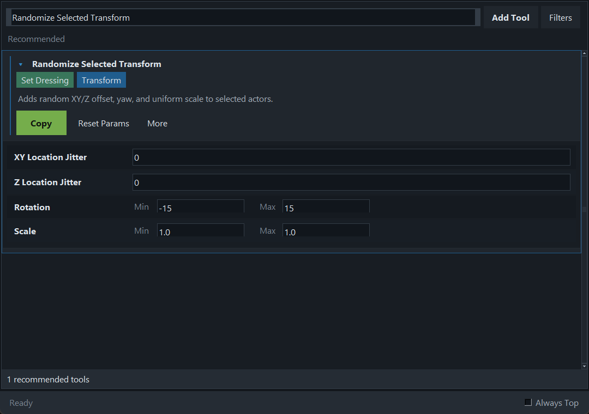
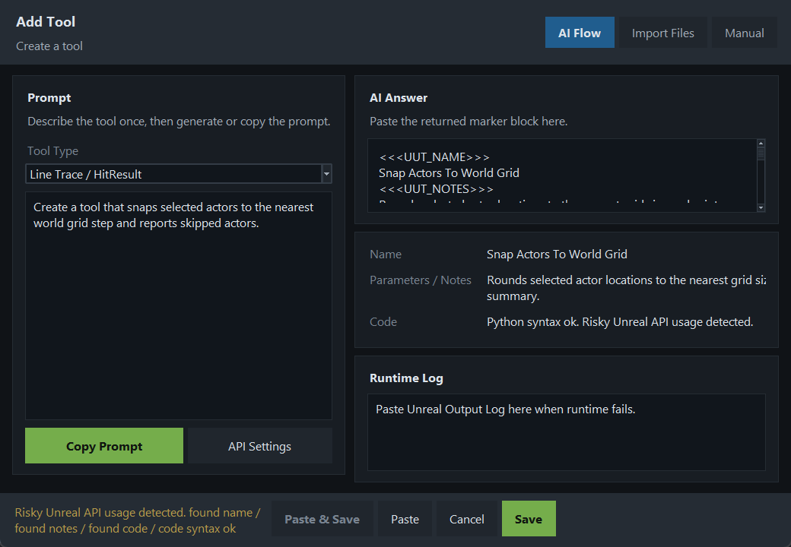
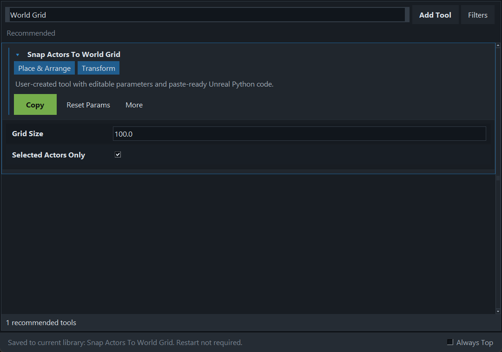

# Visual Walkthrough

EditorBinder is built around a short copy/paste workflow: pick a tool, adjust
parameters, copy the generated Unreal Python script, then paste it into Unreal
Engine's Python Console.

## 1. Open The Library

The default Free Core library starts with everyday Unreal Engine scene cleanup,
placement, audit, and batch editing tools. Expand a tool to inspect its notes
and parameters.

## 2. Adjust Parameters

Tools can expose typed controls with `# Param:` metadata. EditorBinder stores
your current values and replaces parameter placeholders before copying the
script.

## 3. Add A Tool

Use `Add Tool` to paste AI marker-format output, import `.json`, `.txt`, `.py`,
or `.zip` files, or create a tool manually. Review generated scripts before
running them in a production project.

## 4. Save To The Local Library

Saved tools appear immediately in the local library. Restarting EditorBinder is
not required.

